# 数据访问与Swizzling总结

## Introduction

[Flash Attention 2](https://arxiv.org/abs/2307.08691) 算法天然就是为了并行计算设计的。

算法将Q, K和V分别以blcok size为Br, Bc切成tile，然后循环处理每个tile的小矩阵。核心运算包含两个矩阵乘运算(`S = Q x V^T` 和 `O = P x V`)和一个复杂的Online Softmax。因为数据准备和搬运主要涉及Q, K, V和O，所以本节重点关注矩阵乘运算。

Flash Attention 2 算法定义如下：
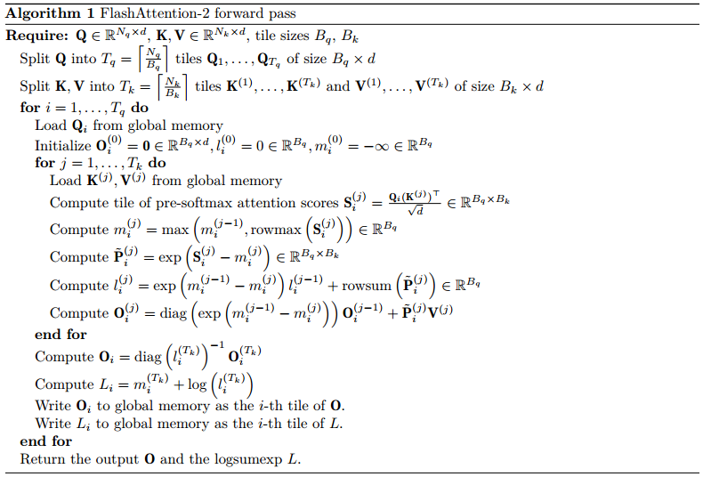

### Instructions

首先关注核心的矩阵乘加mma运算。本实现不考虑quant/dequant的场景，所以input是half的bf16/fp16；同时为了保持精度，softmax使用fp32。

在限定了16-bit inputs和32-bit accumulation之后，Ampere有两个指令：`m16n8k8`和`m16n8k16`。为了效率，选择`m16n8k16`。

#### m16n8k16

[`m16n8k16`](https://docs.nvidia.com/cuda/parallel-thread-execution/index.html#warp-level-matrix-fragment-mma-16816-float)指令，顾名思义，完成的是M = 16, N = 8, K = 16的矩阵乘加运算A x B + C = D。

本文使用的指令如下：

> mma.sync.aligned.m16n8k16.row.col.f32.bf16.bf16.f32

`mma.sync.aligned.m16n8k16`：指令

`.f32.bf16.bf16.f32`：D, A, B, C 矩阵的数据类型,

`.row.col`：分别表示矩阵A按照row-major存储，矩阵B按colomn-major存储。`m16n8k16`指令只支持这一种类型。

A矩阵，行主序：
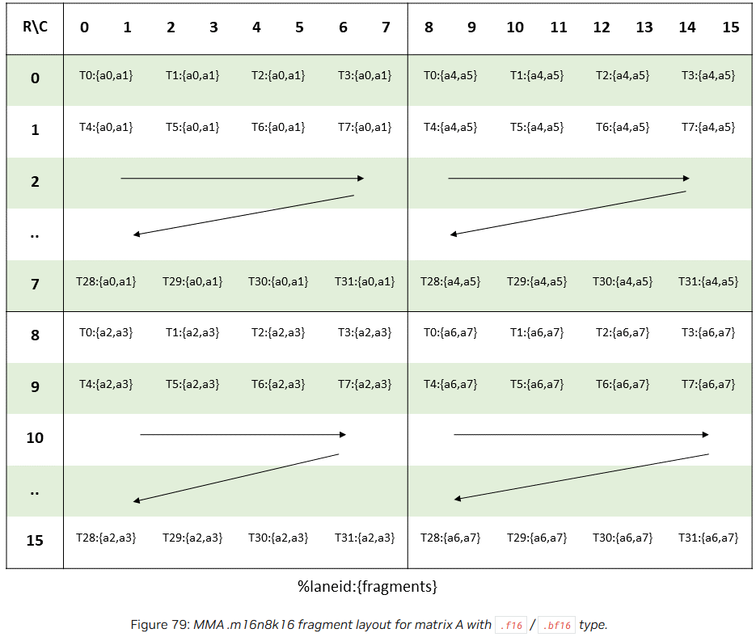

B矩阵，列主序：
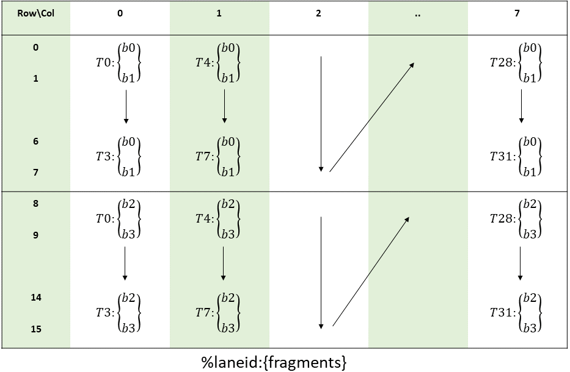

如上图所示，`m16n8k16`在进行运算时，需要A矩阵按row-major存储，B矩阵按colomn-major存储。那么，当输入的所有矩阵都是row-major存储时，对B来说，colomn-major的访问方式相当于做了一次转置。因此，当A和B矩阵都是row-major的话，`m16n8k16`完成的运算其实是`A x B^T + C = D`。但这引入一个问题，虽然B矩阵内存储元素做了转置，但是维度仍然是N x K，怎么满足`m16n8k16`对B矩阵的维度为K x N的要求。

再仔细观察上面的矩阵布局，A和B矩阵都被划分成了不同个(8, 8)的小矩阵，这样的(8, 8)的小矩阵本文称之为**fragment**。`m16n8k16`是一个warp级别的操作，所以能看到每个(8, 8) fragment内元素被映射到一个warp中的32个线程。A由(2, 2)维的(8, 8) fragment构成，B由(2, 1)维的(8, 8) fragment构成。

如下图所示，每个矩阵中的数字表示在内存中的顺序递增的地址。可以看出，原始的A矩阵和B矩阵都是row-major存储的。每个矩阵的深色部分表示一个warp中的thread 0 处理的元素。观察绿色的矩阵B：row-major的(8, 16)的B矩阵和colomn-major的(16, 8)的B^T矩阵，map到Thread 0上的元素是一致的。所以，按照fragment加载，并完成对应的元素映射时，row-major的矩阵B和colomn-major的矩阵B^T是等价的。

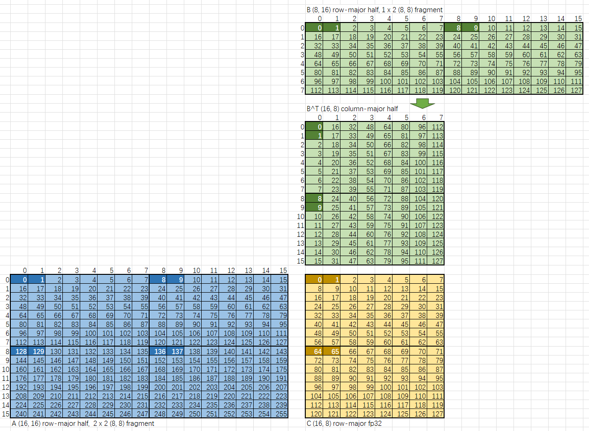

由上面的分析可以看出，一个warp中的每个线程持有的原矩阵的元素是不连续的，并且以(8, 8) fragment为组，对每个fragment持有相同位置的数据。比如下图为thread 0 持有的矩阵A, B, C的元素。

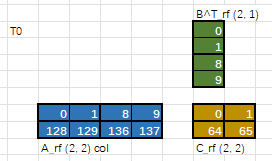

这种按fragment分区的布局，以及fragment内部元素与一个warp上的32个thread映射的方式，让矩阵从smem到RF的加载变得很复杂。幸好，NVidia的[PTX](https://docs.nvidia.com/cuda/parallel-thread-execution/index.html)提供了一个与之配套的warp级别的矩阵加载指令`ldmatrix`，用于将一个1，2或4个(8, 8)的fragment从shared memory加载到每个线程的寄存器中。

（此处吐槽一下intel的AMX指令集，硬件限制导致无法配置的A, B矩阵形状 + 繁琐的B矩阵layout限制，是一场没有意义的对脑力和精力的双重拷打）


#### ldmatrix

对于一个(8, 8)的fragment，[`ldmatrix`](https://docs.nvidia.com/cuda/parallel-thread-execution/index.html#warp-level-matrix-instructions-ldmatrix)使用8个thread，每个thread处理一行中的连续的8个half元素，并将其加载到4个32-bit的寄存器中，每个寄存器存储2个half元素，如下图所示。与前文mma的A矩阵布局比较，由`ldmatrix`加载的一个fragment的矩阵上寄线程寄存器的布局和`m16n8k16`的要求一致。

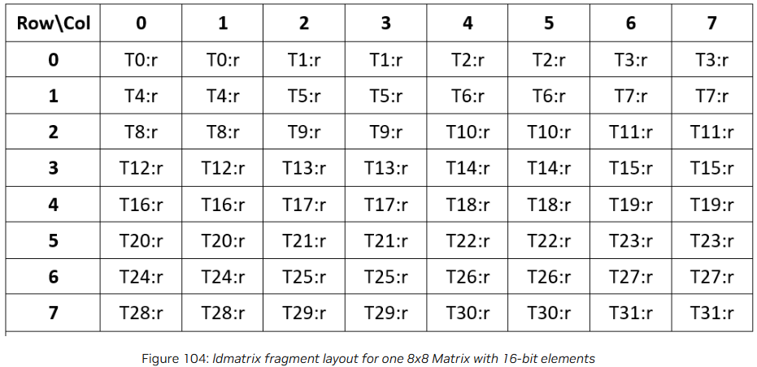

为了保证灵活性，`ldmatrix`只要求(8, 8)的fragment的每一行上的8个half元素是连续的，而行间的位置可以不连续。由于一个线程处理一个(1, 8)的行，每个线程需要对应行的首地址。8个thread可以加载一个(8, 8)的fragment。一个warp的32个thread，可以同时加载4个fragment，映射关系如下表格：

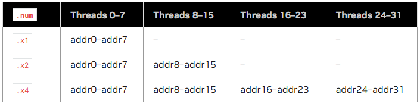

此外，值得注意的是，当使用`ldmatrix.x4`时，加载的(2, 2)维的(8, 8) fragment，是按照**row-major**排列的。`m16n8k16`进行运算时，也是按照**row-major**访问寄存器中的元素的。比如，如下图所示，对于thread 0来说，看到的A矩阵的元素顺序是(0 1) -> **(128 129) -> (8 9)** -> (136 137)。

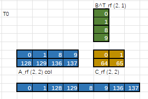


##### ldmatrix.trans

如前文所述，如果输入矩阵A和B的存储方式是row-major的，那么`m16n8k16`完成的运算是`A x B^T + C = D`。这与`S = Q x K^T`相匹配。但是对于`O = P x V`，由于V是非转置的，因此需要通过`ldmatrix.trans`在加载的时候进行转置加载，才能符合`m16n8k16`对于B矩阵的要求。如下图所示，对于thread 0的RF内存储的元素，转置过的V矩阵的第一个fragment，与按行排列的B矩阵的一致。

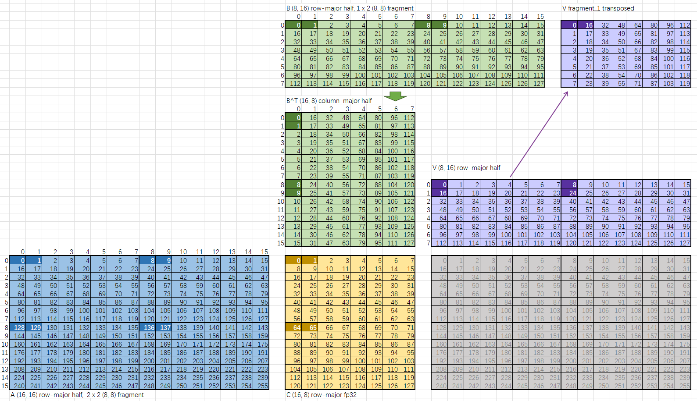


## Flash Attention中的Q, K, V

数据搬运与计算任务沿着CTA -> warp -> thread分配，一个CTA包含4个warp，每个warp包含32个thread，所以一个CTA包含128个线程。

### CTA-Level的任务分配

#### 任务与对应数据

首先，确定Q, K, V的输入形状。本篇考虑的是最原始的形状，即`(batch_size, seq_len, d_model) -> (batch_size, seq_len, n_heads, d_head)`，并通过对矩阵的加载映射完成一个(sample, head) pair的局部矩阵的加载。

根据Flash Attention 2算法，Q和K, V分别沿着seq_len维度做分割，Q的block size为Br，K和V的block size为Bc。这里先设定Br = 64, Bc = 64，而大模型的d_head维度普遍为128。那么：

* Q 和 O 的tile维度：(Br, dhead) = (64, 128)
* K 和 V 的tile维度：(Bc, dhead) = (64, 128)

参考Flash Attention 2算法，对于相同(sample, head) pair的Q, O, K, V：`Tr = seq_len/Br`个Qi，需要沿着K和V的seq_len，与`Tc = seq_len/Bc`个Kj和Vj做计算，生成`Tr = seq_len/Br`个Oi。

任务以处理一个(Br, dhead)的Qi tile为单位，一共需要处理`batch_size * n_heads * Tr`个Qi tile。


#### 工作组 CTA

一个CTA负责处理一个形状为(Br, dhead)的Qi tile，一个kernel grid就需要映射到类似`(sample, query_block, head)`的形状。

CTA launch的顺序是：`blockIdx.x + blockIdx.y * gridDim.x + gridDim.x * gridDim.y * blockIdx.z`。

由于一个CTA处理的是一个Qi tile，那么在相同时间内会有多个CTA在不同的SM上，同时处理同一个(sample, head) pair的其他Qi tile。它们需要的K和V是相同的。因此，为了充分利用L2 cache局部性，x与Q_block映射，block的整体映射关系为`(x, y, z) -> (Q_block, head, batch)`。代码如下：

```
    // ...
    const int sample = blockIdx.z;
    const int head = blockIdx.y;
    const int q_seq_block = blockIdx.x;
    // ...
```

### Warp-Level的工作分配

如前述，一个CTA处理Flash Attention的一个外层for循环，即一个(Br, dhead)的Qi的相关计算。为了简略，设定`(Br, dhead) = (64, 128)`。

一个CTA包含4个warps，时分复用同一个SM的硬件资源，那么每个warp沿着Br (aka seq_len)方向可以分成64 / 4 = 16行，即一个warp处理一个(16, 128)形状的Q的sub-tile。

同时，处理这些sub-tile仍然需要对应的完整的(Bc, dhead)的K tile和V tile。这里，由于4个warp处于同一个CTA，共享同一个SM的smem加载的K和V，可以充分利用数据的局部性。

细分一下Warp-Level的工作内容：

* 每个warp独立处理(16, 128)形状的 Q sub-tile和对应的O sub-tile，包含数据搬运和计算
* Warp合作处理K和V：
  * 合作完成gmem到smem的搬运，每个warp分到(16, 128)的切片
  * 完成搬运后，warp-level同步信息
  * 每个warp分别把对应的完整的K和V从SMEM搬到自己的RF里


### Data movement strategy

GPU的内存架构如下，需要完成数据在gmem <-> smem <-> RF中的搬运。

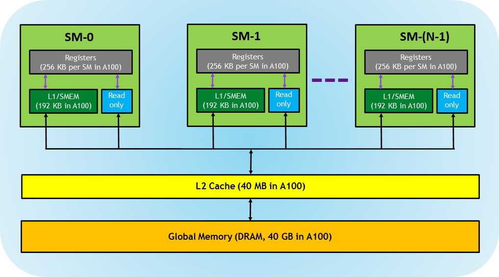


LDST操作整理：

| From | To   | Blocks | PTX Instr. / C++ | Warp-Wide Op Size | Thread | Thread ID | Register | Notes                |
|------|------|--------|------------------|-------------------|--------|-----------|----------|----------------------|
| GMEM | SMEM | Q, Kj, Vj | cp.async       | (4, 64)          | (1, 8) | Row-major |          |                      |
| SMEM | RF   | Q, Kj, Vj | ldmatrix.x4    | (16, 16)         | (1, 8) | Column-major | (2, 2) | Vj transpose       |
| RF   | SMEM | O       | standard (4B)   | (8, 8)           | (1, 2) | Row-major | (1, 1) |                      |
| SMEM | GMEM | O       | standard (16B)  | (4, 64)          | (1, 8) | Row-major |          |                      |

每个Tensor传输的信息汇总（B_r = 64, B_c = 64, d_head = 128, n_warps = 4）：
| Element | Size (bytes) | GMEM+SMEM Majorness | GMEM↔SMEM Shape | RF Majorness | SMEM Shape | RF Shape (Registers) |
|---------|--------------|---------------------|-----------------|--------------|------------|----------------------|
| Q       | 2            | Row major           | (16, 128)       | Row major    | (16, 128)  | (2, 16)              |
| Kj      | 2            | Row major           | (16, 128)       | Row major    | (64, 128)  | (8, 16)              |
| Vj      | 2            | Row major           | (16, 128)       | Column major | (64, 128)  | (16, 8)              |
| Sj      | 4            | N/A                 | N/A             | Row major    | N/A        | (2, 16)              |
| Pj      | 2            | N/A                 | N/A             | Row major    | N/A        | (2, 8)               |
| Oj      | 4            | N/A                 | N/A             | Row major    | N/A        | (2, 32)              |
| O       | 2            | Row major           | (16, 128)       | Row major    | (16, 128)  | (2, 16)              |


#### GMEM <-> SMEM

##### GMEM -> SMEM

* `cp.async`加载指令
  
  从GMEM往SMEM加载时，使用`cp.async`。`cp.async`有专门的硬件DMA引擎，用于处理批量数据传输。而使用常规的方式，将数据从GMEM拷贝到SMEM时，会经过RF：GMEM -> RF -> SMEM。

  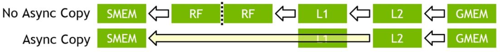
  
  它可以拷贝4, 8, 16B 的数据。当拷贝16B 时，可以配置bypass L1 cache。为了效率，选择**16B拷贝**。

  * 使用方式
    * `cp.async.commit`：打包提交所有当前未提交的`cp.async`为一个group
    * `cp.async.wait_group n` / `cp.async.wait_all`：等待，直到剩下最后n个group
      * `cp.async.wait`：等待当前thread

  
* 数据搬运
  
  GPU的cache line大小是128B。使用`cp.sync`时，每个thread传输16B。那么一整行cache line需要8个thread处理。一个warp有32个thread，则一个warp-wide指令`cp.sync`可以传输4 x 128B大小的内存。使用half精度，每个元素2B，也就是可以传输(4, 64)形状的元素矩阵。

  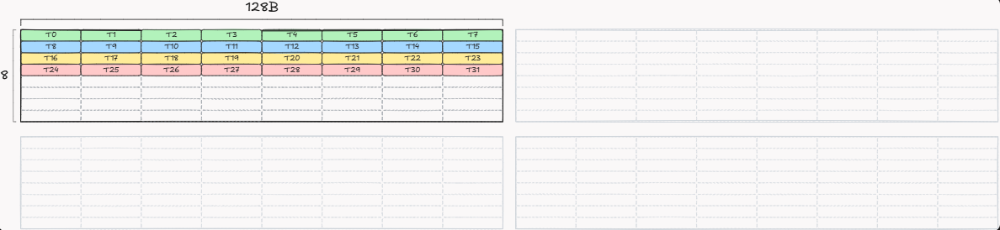

  对于上述的一个(16, 128) sub-tile，需要(4, 2)个`cp.sync`

##### GMEM <- SMEM

  Ampere不支持与`cp.async`对称的`st.async`。因此使用16B向量化存储，如下。

  ```
  reinterpret_cast<uint4*>(GMEM[dst])[0] = reinterpret_cast<uint4*>(SMEM[src])[0];
  ```

#### SMEM -> RF 

虽然K和V矩阵都是作为`m16n8k16`的B矩阵，完成运算需要2个(8, 8) fragment，可以使用`ldmatrix.x2`。但为了搬运效率和代码的一致性，仍然使用`ldmatrix.x4`。这会对K矩阵的运算造成一些影响，后面再讨论。

对于Q和Kj，(2, 2)的(8, 8) fragment的加载如下：
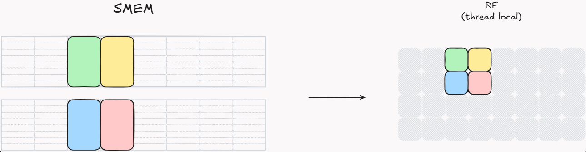

对于Vj，`ldmatrix.trans`在(8, 8) fragment内部完成了转置，通过交换传入的(0, 1)和(1, 0) fragment顺序，完成了整体的转置：
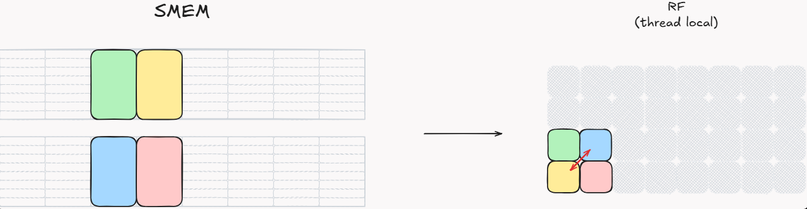

#### RF → SMEM 

Amphere不支持`stmatrix`，使用非向量化的4B `smem[dst] = rf[src];`硬搬。因为在设计时，直到最后阶段，才有矩阵O的搬出操作，所以性能影响相对较小。

对于一个(8, 8)的fragment，每个half元素2B，那么一个fragment的大小是8 x 16B。一个线程处理4B，4个线程处理一行16B。一个warp中的32个线程，处理一个(8, 8) fragment。

一个warp需要搬运O的一个(16, 128) sub-tile，需迭代(2, 16)次。


## Bank conflicts 和 Swizzling

### Bank conflicts

#### 什么是Bank conflicts

* 传统访问模式的bank conflicts

  在NVidia的架构中，Shared Memory按照4B宽度，被划分为32个bank。当一个warp中的不同thread同时访问一个bank上的不同元素时，就会发生bank conflict。比如，当thread 0和thread 2同时访问bank 1的不同元素地址1和地址65，schedular需要2拍完成对应内存的读取，形成2-way bank conflict。

  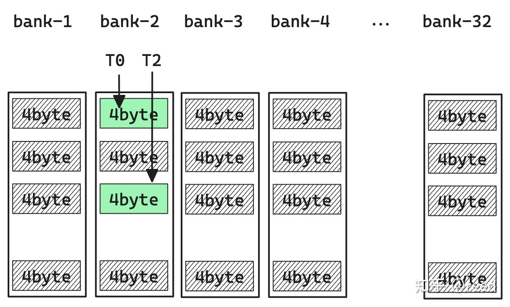

* 向量化访问模式的bank conflicts

  在本实现中，数据在GMEM <-> SMEM和SMEM -> RF传输时，使用的是向量化LDST指令。这种指令也称为大字长读写指令，顾名思义，就是一个线程单次访问的元素大于等于4B。本文中使用的`cp.async`和`ldmatrix`都是每个线程单次处理**16B**元素，横跨4个bank。

  在16B向量化LDST指令下，一个warp中的32个线程会被分成4个阶段，每个阶段8个线程并行执行。
  | Phase | Threads |
  |-------|---------|
  | 0     | 0-7     |
  | 1     | 8-15    |
  | 2     | 16-23   |
  | 3     | 24-31   |
  
  每个线程单次访问连续的4个4B存储空间，即连续的4个bank。当同一阶段的thread访问的连续的4个bank有重叠时，会发生bank conflict。

  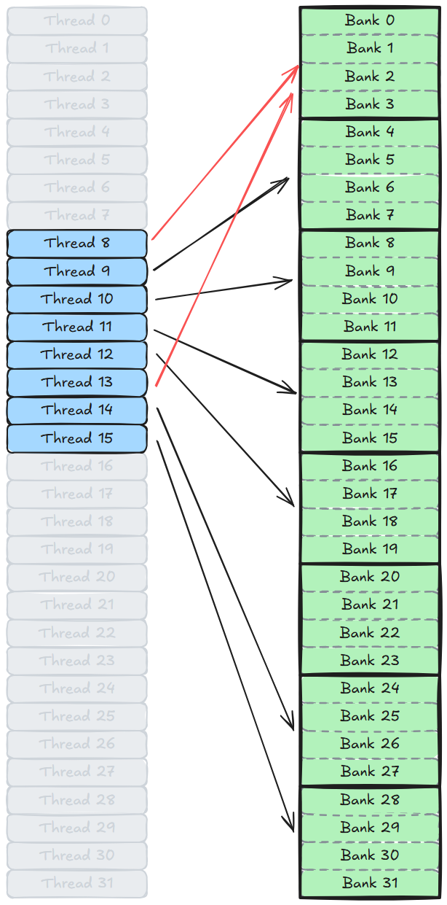

  而不同阶段的thread访问相同的bank时不会发生bank conflict。

  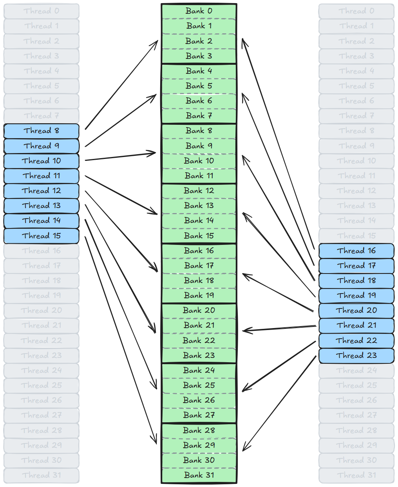


#### 当前Case为什么会发生Bank conflicts

回顾之前的数据加载方式：

* SMEM -> RF
  使用`ldmatrix`指令，同组的8个线程同时加载同列的8行数据，造成**8-way bank conflicts**。
  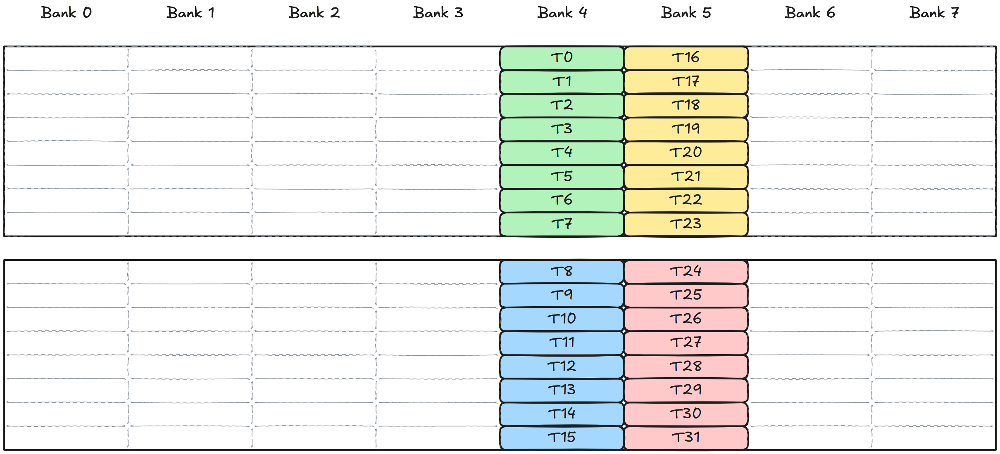

* RF -> SMEM
  没有使用向量化加载，一个warp中的32个thread同时加载一个(8, 8)的fragment，造成**8-way bank conflicts**。
  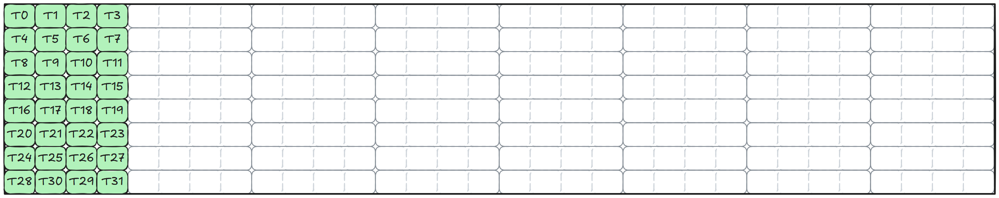
  
* GMEM <-> SMEM
  同组的8个线程同时加载1个cache line的128B数据，没有bank conflicts。
  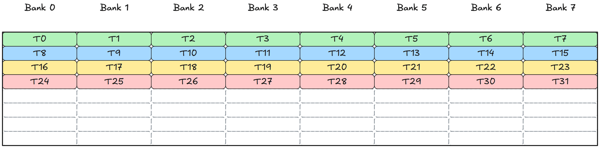


### What's swizzling and why it helps

数据初始存储在GMEM，最后完成计算在RF，中间的SMEM相当于一个加速缓冲池。当数据在RF内的布局和GMEM一致时，数据在SMEM的排布不会对结果的正确性造成影响。因此，如果找到某种方式，能够加载和复原数据在GMEM和RF中的排布，同时避免shared memory的bank conflicts的limitation。这种方式被称为Swizzling。

#### 异或运算XOR

异或运算XOR的定义是，对于1-bit数据，相同输出0，相异输出1。满足交换律，结合律。同时，对于集合`S = {x, x ∈ [0, 2^n - 1]}`中的任意两个元素，异或形成的输出满足封闭性。下图显示，该结果满足双射性（bijective）。

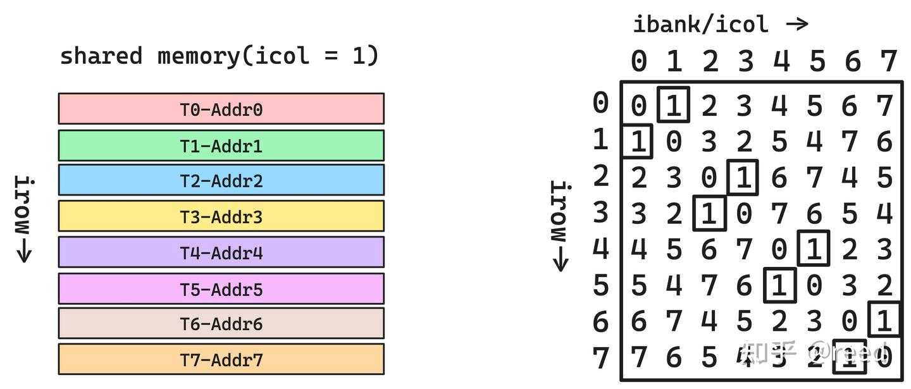

由上图可以看出，对于相同的icol，与不同的irow进行异或后，输出的结果分布在8个不同的行和列上，满足对bank confclits的要求。同时，由于异或操作的可逆性`a XOR b XOR b = a`，当使用两个相同的异或操作后，对应的数据可以被复原。

合理运用异或，可以通过优化数据在SMEM的访问，避免bank conflicts。一般使用方式是：用`irow XOR icol`替换`irow`或者`icol`。

本节出处：[cute 之 Swizzle](https://zhuanlan.zhihu.com/p/671419093)

##### 数独式映射

数独式映射就像数学上的拉丁方阵(Latin square)，满足两个条件：
* 每行包含唯一元素
* 每列包含唯一元素

比如下面是非XOR的一个类数独的映射：

```
r\c  0  1  2  3
0    2  3  1  0
1    0  1  2  3  
2    1  0  3  2
3    3  2  0  1
```

* 如何理解这个表格：
  * 顺序递增的行索引r = 0-3和列索引c = 0-3，表示在smem上存储的位置，称为物理行/列
  * 单元格里的数据表示物理行列(irow, icol)上存储元素，原本在gmem中存储的位置，称为逻辑行/列（因为swizzling是从smem的layout来观察的矩阵的）
* 由于单元格的数字在每行和每列都唯一，当同时访问同一逻辑行或逻辑列时，会被分散到不同的smem的bank上。

因此，任何满足拉丁方阵的数独式映射方式，都可以作为swizzling的方式。为什么用XOR？因为它最简单！

### 使用Swizzling优化bank conflicts

基础用法：用`arr[row][row XOR col]`替换`arr[row][col]`。

* 向量化Swizzling

  向量化访问地址空间时，一次访问连续的4个4B数据，也即8个16-bit元素。因此，在加载时，可以将连续的打包视为一个16B元素。比如Cutlass由此定义了`uint128_t`的类型。

  当使用swizzling时，将当前16B数据的row base addr与col addr异或，即可算出smem中的物理列。

* 非向量化Swizzling

  在当前实现中，RF -> SMEM使用的是标准的4B ST方式。但数据仍然需要保持相同的swizzle layout。怎么处理？

  在之前的设计中，一个warp中的32个thread合作搬运一个(8, 8) fragment，每个thread负责4B，一行16B由四个thread负责。这一行的row address被这四个thread共享。因此，可以将一行四个元素打包，通过swizzling共享的当前行的*row base address*，实现与上述向量化swizzling相同的layout。

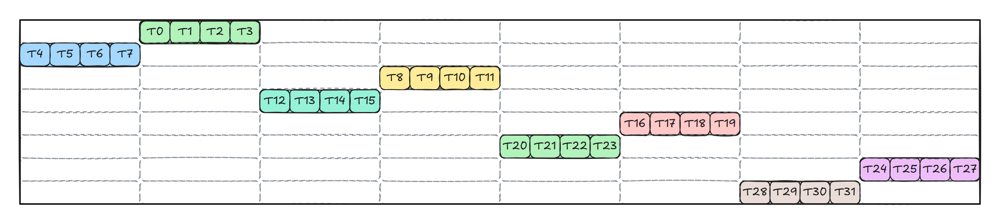

Swizzling的代码如下：
```
__forceinline__ __device__ constexpr int get_swizzled_col(const int &row, const int &col) {
    // Restrict the swizzled column to the
    // (8, 128) byte region it's in.
    // Not strictly necessary, but we'll need it in later kernels.
    const int region_row = row % BANKS_PER_VEC4_ACCESS;
 
    // Convert column byte offset to 16B bank index since we have 8 banks of 16B each.
    // This transforms the column coordinate from element space to bank space
    const int bank_col = col / ELEMS_PER_BANK;
    
    // Preserve the byte offset within each 16B bank for non-vectorized RF→SMEM stores
    // This ensures threads in the same 4-thread group maintain their relative positions
    const int bank_offset = col % ELEMS_PER_BANK;
 
    // Apply XOR swizzling to distribute consecutive row accesses across different banks
    // Then reconstruct the final column address by scaling back to element space
    return ((region_row ^ bank_col) * ELEMS_PER_BANK) + bank_offset;
}

```


### 用静态的方式Swizzle

上面的Swizzling方式看起来很美好，但最后编译出的SASS代码中，围绕Swizzling的实现，出现了很多schalar指令用于计算地址，如`LOP3.LUT`, `IMAD.SHL.U32`, 和`SHF.L.U32`。而增加的指令也导致了额外寄存器的使用。

下面是相同的kernel，使用上述swizzling和没有使用swizzling时，`LDSM` (`ldmatrix`)使用寄存器数量的对比。

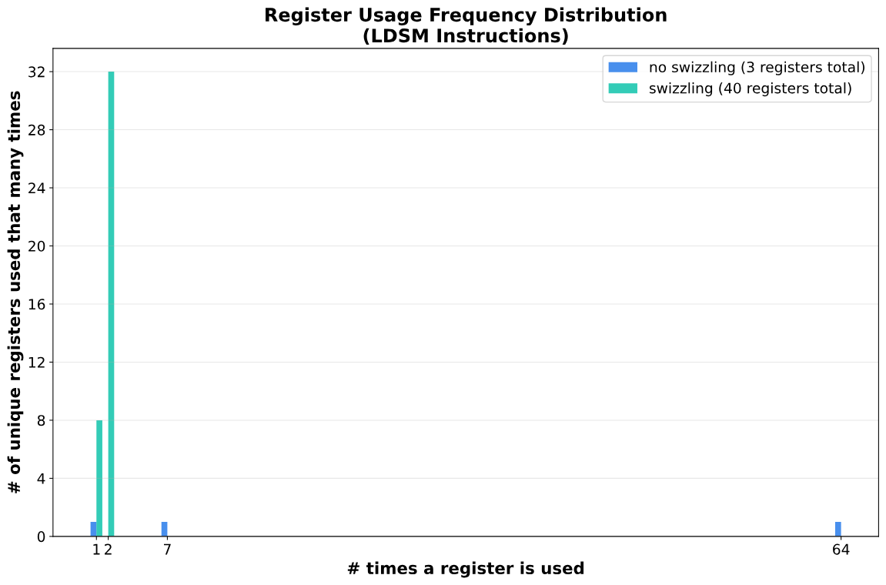

由于所有访问smem的操作都需要经过Swizzling，这些增加的指令和寄存器使用对整体性能会造成不可忽视的影响。


为什么会这样？

原因在于上面的swizzle的写法直白，但写得不够“好”，不够好到让编译器轻松优化：

  * 在**每次迭代**中，即使base addr被share了，几乎所有的addr offsets在都会被重新计算
  * 编译器不能很好得总结swizzling规律，从而优化代码（人脑都很难理解Swizzling，更何况编译器）

**解决方案**：找到swizzling的静态规律，并按照这个规律写代码，使编译器可以cache offsets，而不要每次迭代都重新计算offsets。

下面的代码是最终使用的Swizzling function:
```
// Adapted from https://leimao.github.io/blog/CuTe-Swizzle/.
template <int BBits = 3, int MBase = 0, int SShift = 3>
struct CuteSwizzle {
    static constexpr int mbase = MBase;
    static constexpr int mask_bits = BBits;
    static constexpr int mask_shift = SShift;

    static constexpr int bit_mask = (1 << mask_bits) - 1;
    static constexpr int yy_mask = bit_mask << (mbase + mask_shift);
    static constexpr int yy_mask_lowest_bit = yy_mask & -yy_mask;

    FA_DEVICE_CONSTEXPR static auto apply(int const &offset) {
        const int row_shifted = (offset & yy_mask) >> mask_shift;
        return offset ^ row_shifted;
    }
};
```

CuTe的[`class Swizzle`](https://github.com/NVIDIA/cutlass/blob/b0e09d7cd371eded41f7c1e057caf1593c27ba55/include/cute/swizzle.hpp#L55)也有类似的模板写法，但可扩展性更强。

接下来分析一下为什么要这么写。


#### Swizzling Patterns & Strided Swizzling

重新观察一下应用XOR的Swizzle方阵：


(4, 4):
| irow\icol | 0 | 1 | 2 | 3 |
|-------|---|---|---|---|
| 0     | 0 | 1 | 2 | 3 |
| 1     | 1 | 0 | 3 | 2 |
| 2     | 2 | 3 | 0 | 1 |
| 3     | 3 | 2 | 1 | 0 |

(8, 8):
| irow\icol | 0 | 1 | 2 | 3 | 4 | 5 | 6 | 7 |
|-----|---|---|---|---|---|---|---|---|
| 0   | 0 | 1 | 2 | 3 | 4 | 5 | 6 | 7 |
| 1   | 1 | 0 | 3 | 2 | 5 | 4 | 7 | 6 |
| 2   | 2 | 3 | 0 | 1 | 6 | 7 | 4 | 5 |
| 3   | 3 | 2 | 1 | 0 | 7 | 6 | 5 | 4 |
| 4   | 4 | 5 | 6 | 7 | 0 | 1 | 2 | 3 |
| 5   | 5 | 4 | 7 | 6 | 1 | 0 | 3 | 2 |
| 6   | 6 | 7 | 4 | 5 | 2 | 3 | 0 | 1 |
| 7   | 7 | 6 | 5 | 4 | 3 | 2 | 1 | 0 |


有以下规律：
* 当icol = 0时，对应index = irow
* 间隔1列对比，如第0/1列，第2/3列：
  * 偶数行如0, 2, 4, 6的index增加1
  * 奇数行如1, 3, 5, 7的index减少1
* 间隔2列对比，如第0/2列，第1/3列：
  * 第0/1行，第4/5行的index增加2
  * 第2/3行，第6/7行的index减少2

这显示这个矩阵是根据初始offset，以步长为单位，做某种规律性变化。

把irow视为thread T，icol视为smem的物理列，表格内的index视为逻辑列的index。以下是总结的规律：
* Thread T起始位置为逻辑列T (base offset)
* 随着icol的增加，index以2的幂次方为单位变化：±1, ±2, ±4, etc.
* 正负符号与对应的thread T有关

(4, 4)矩阵间隔对应stride时，index的变化：
| Thread | Stride (2, 1)| Base Offset |
|--------|----------|-------------|
| 0      | (2, 1)   | 0           |
| 1      | (2, -1)  | 1           |
| 2      | (-2, 1)  | 2           |
| 3      | (-2, -1) | 3           |


(8, 8)矩阵间隔对应stride时，index的变化：
| Thread | Stride (4 , 2, 1)| Base Offset |
|--------|------------|-------------|
| 0      | (4, 2, 1)  | 0           |
| 1      | (4, 2, -1) | 1           |
| 2      | (4, -2, 1) | 2           |
| 3      | (4, -2, -1)| 3           |
| 4      | (-4, 2, 1) | 4           |
| 5      | (-4, 2, -1)| 5           |
| 6      | (-4, -2, 1)| 6           |
| 7      | (-4, -2, -1)| 7          |

* CuTe
  
  CuTe设计了写法更烧脑的Strided pattern的offset的计算方式，可以参考[CUDA Shared Memory Swizzling](https://leimao.github.io/blog/CUDA-Shared-Memory-Swizzling/#CUDA-Shared-Memory-Swizzling)。

  Base idea如下，`k`线程索引：
  ```
  offset = base + k * stride
  swizzled_offset = offset ^ ((offset & mask) >> shift)
  ```

#### Swizzle Regions

在本案例要处理的场景中，一个warp的32个线程最多需要操作的segment是从gmem搬运数据到smem时，并行操作的8 x 128B矩阵，因此，swizzling pattern以8行/8列为单位重复。

把这个矩阵定义为一个swizzle region。当这个矩阵的访问不重复时，就可以避免bank conflict了。
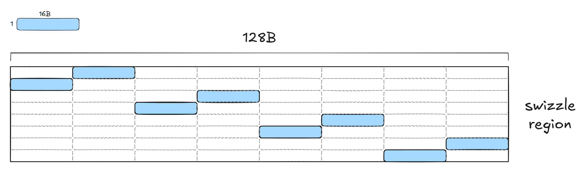

对应的swizzle patten可以复制到相同形状的其他矩阵：
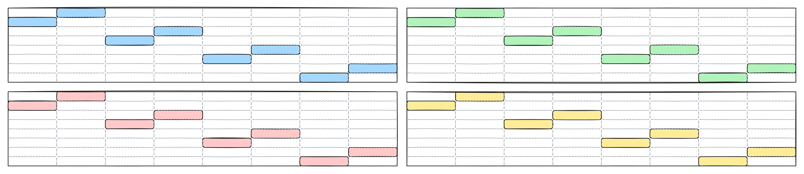


优化的思路是：在一个swizzle region内，把相应的strides和offsets先计算一遍，然后将这个strides和offsets应用到其他所有swizzle region中。

之前，每次传输需要根据当前行（即thread）和列，重新计算一遍当前pattern swizzle后的index。现在，传输一个swizzle region，每个线程在迭代时，只需要传入swizzle stride，再依据base offset，应用static swizzle pattern。这样的方式，大大减少了访问smem时计算addr的次数。


#### Swizzle Regions的应用

##### GMEM <-> SMEM

在之前的介绍中，GMEM <-> SMEM的数据传输中，一个warp单次传输一个4 x 128B的矩阵传输，对于一个8 x 128B swizzle region，则需要经过2次iteration完成传输。而这两次传输的sub-tile在我们定义的Swizzle region中分属上半段和下半段，导致相应base addr和stride的计算在两个warp间不统一。所以，如果仍然依照原来的方案，需要针对这两个sub-tile计算2个不同的访问模式。

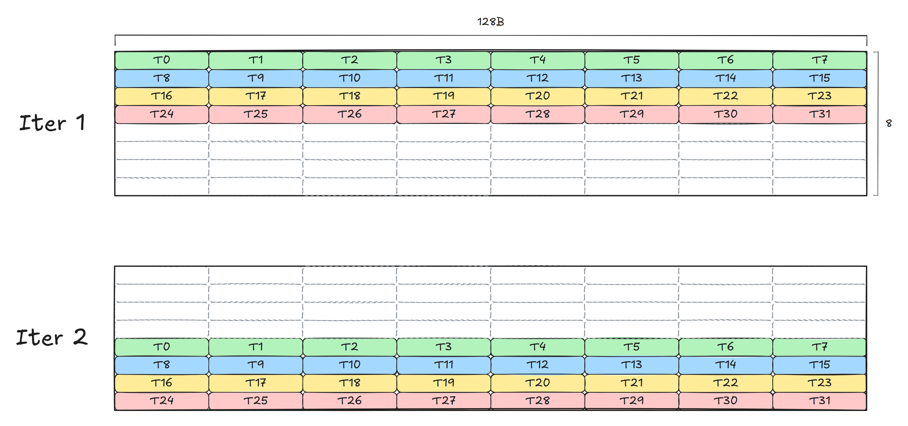

幸运的是，在GMEM <-> SMEM的传输中，可以使用跨warp（CTA-level）的协作模式。因此，可以让一个CTA中的warp协作完成多个swizzle region的传输。

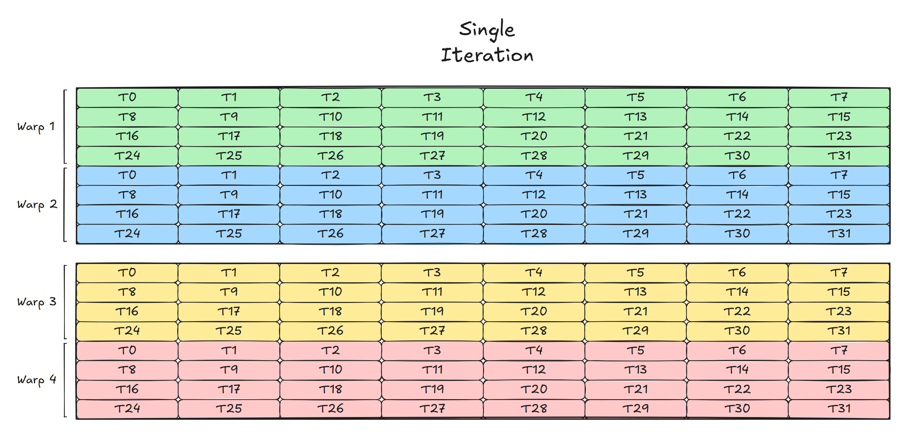

##### SMEM -> RF

在SMEM -> RF的case里面，每个warp的32个thread单次传输一个(16, 2)的sub-tile，需要通过四次iteration才能完成一个swizzle region的传输。这次只能老老实实计算对应的四种访问模式。

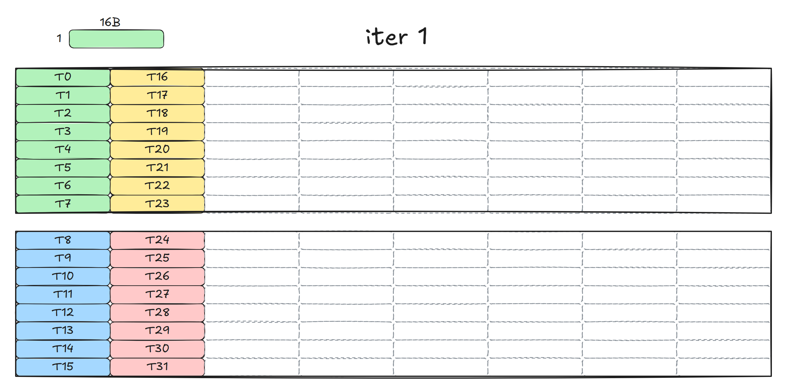
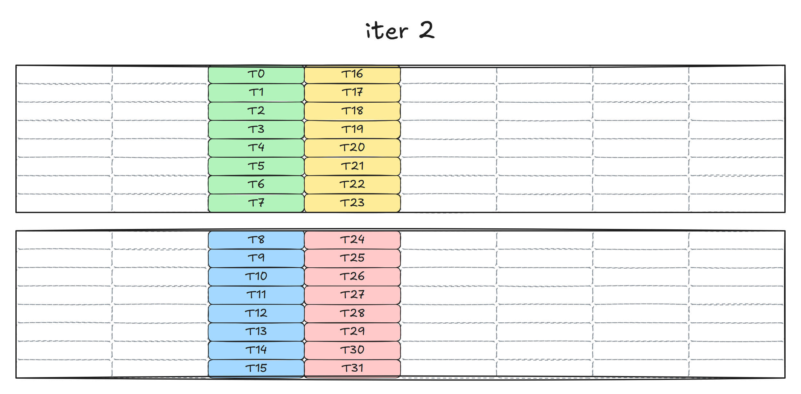
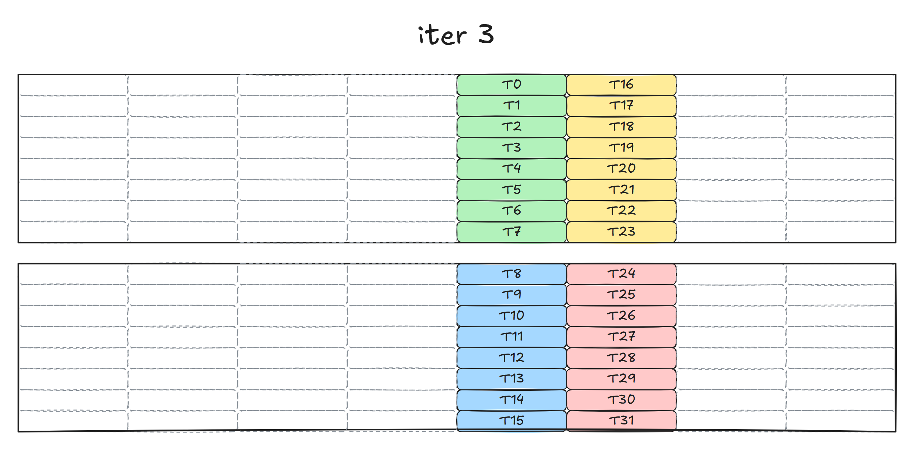
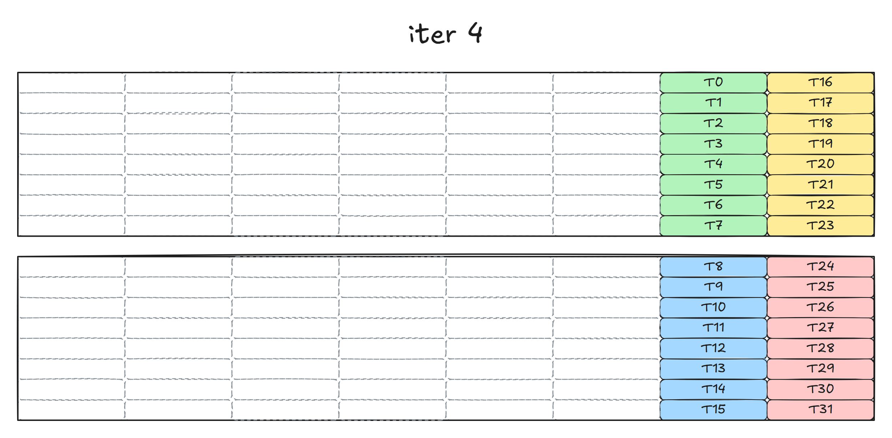

##### RF -> SMEM

虽然RF -> SMEM的数据传输是4B为单位的，但在我们定义的搬运模式里，一行16B由4个thread配合完成。因此仍然可以以16B为单位，应用之前的swizzle方式。


