# 计算优化总结

观察下面的attention公式，

$$
\text{Attention}(Q, K, V) = \text{softmax}\left(\frac{QK^T}{\sqrt{d_{\text{head}}}}\right)V
$$

计算可以被分为两类：

* 矩阵乘法(GEMM)：基于 Tensor Core 做MMA运算，采用 FP16/BF16 精度计算
* Softmax运算：由 CUDA Core 中的标准浮点单元执行，采用 FP32 精度

## GEMM

### 基础版本

本文通过mma的m16n8k16完成matmul。下图是一个MMA的操作示意图，可以看出：
* A的维度为(m, k) = (16, 16)
* B的维度为(n, k) = (8, 16)
* C和D的维度为(m, n) = (16, 8)

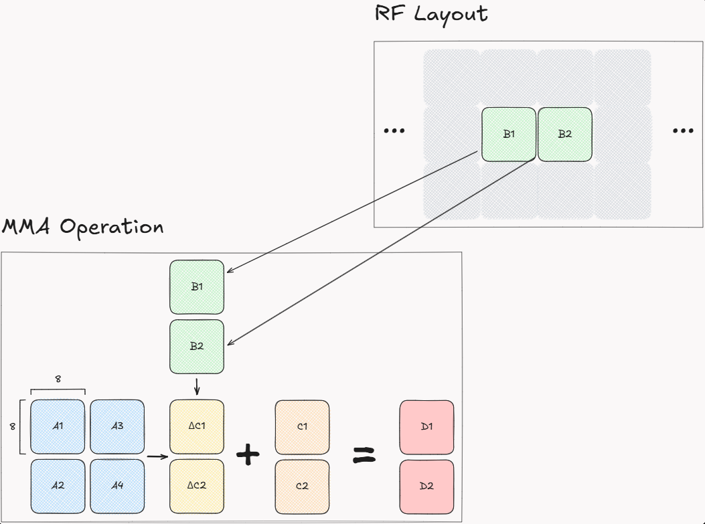

那么如果要完成[数据访问与Swizzling](./1_数据访问与Swizzling.md)中，从smem搬运到RF上的数据，对应的迭代次数如下：

| A         | A Shape (Registers) | B               | B Shape (Registers) | Iteration Shape (k, m, n) |
|-----------|---------------------|-----------------|---------------------|---------------------------|
| Q         | (2, 16)             | KT              | (8, 16)             | (8, 1, 8)                 |
| P         | (2, 8)              | Vj (transposed) | (16, 8)             | (4, 1, 16)                |

### 沿着k维度切分计算任务

上面的版本是一个最基础的版本，但存在几个问题：

1. ldmatrix单次拷贝(16, 16)矩阵的元素，然后迭代着依次拷贝下去。在拷贝后面的元素的时候，前面的元素已经准备好了，可以开始计算；
2. 仔细观察reserve的A shape和B shape，k-dimension很大，对应的是d_head维度。而当B_r或者B_c增加的时候，m和n维度会变大，从而很容易导致register spill。

此处引入Cutlass GEMM关于k维度的优化策略。

#### Cutlass GEMM: spliced-k & split-k

Cutlass GEMM关于K维度的优化策略，主要是针对m/n维度较小而k维度较大的GEMM。

基本策略是：对于一个大小维`[BM, BN, BK]`维度的work tile，除了沿着M/N维度切分之外，沿着K维度也把任务进行了切分。如此一来，待处理的可并行任务的工作量从`[WM, WN, BK]`变成了`[WM, WN, WK]`，与之相对应的，并行处理任务数量从`[BM/WM, BN/WN, BK]`变成了`[BM/WM, BN/WN, BK/WK]`。

由于沿着K维度做了任务的切分，每个执行子单元算出来的值是不完整的，需要和相同m/n沿着k维度切分的其他fragments的计算结果做reduce。


这里显示出了spliced-k和split-k由于执行单元的并行化粒度，导致的reduce阶段的复杂性的差异。下面是两者的定义：

> sliced-k: reduction across warps on shared memory in CTA
> 
> split-K: reduction across CTAs

总体来说，sliced-k发生在一个SM上，因此可以通过shared memory进行结果的同步，比如依靠shared memory的一个partial accumulation sums累加结果；而split-K由于涉及到跨SM的数据同步，有一些更复杂的规约策略。

细节请参考[cutlass GEMM——sliced-K、split-K & stream-K 分析 （一）](https://zhuanlan.zhihu.com/p/713411778)


#### 应用在本案中

本案的任务相对而言更直观，是在一个warp内部进行reduce的，所以可以复用MMA的C&D的寄存器累加结果，完成在RF上的归约。

由此，Q, Kj和Vj的RF shape可以进一步削减为下表。Q, Kj 和Vj的每个slice包含2个fragments，也就是16个元素的宽度，这也是`ldmatrix`的加载宽度。

| Tensor | Format      | Full Shape | Sub-tile Shape (Fragments) | # Tiles   | mma matrix variable (Fragments) |
|--------|-------------|------------|----------------|-----------|---------------------------------|
| Q      | Row major   | (2, 16)    | (2, 2)         | (1, 8)    | A                               |
| Kj     | Row major   | (8, 16)    | (8, 2)         | (1, 8)    | B                               |
| Vj     | Column major| (16, 8)    | (16, 2)        | (1, 4)    | B                               |


* 为什么选择在k维度上切分任务

  通过Arithmetic Intensity进行定量分析：假设A有`Fr = 2`个MMA的行fragment，B有`Fc = 8`个MMA的列fragment，那么：
  
  1. 如下图，按行加载A，按列加载B。为了计算GEMM，A的每行计算，都需要重新加载一遍完整的B：`MMAs performed / Total fragments loads = Fr * Fc / (Fr + Fr * Fc) = 0.89`
    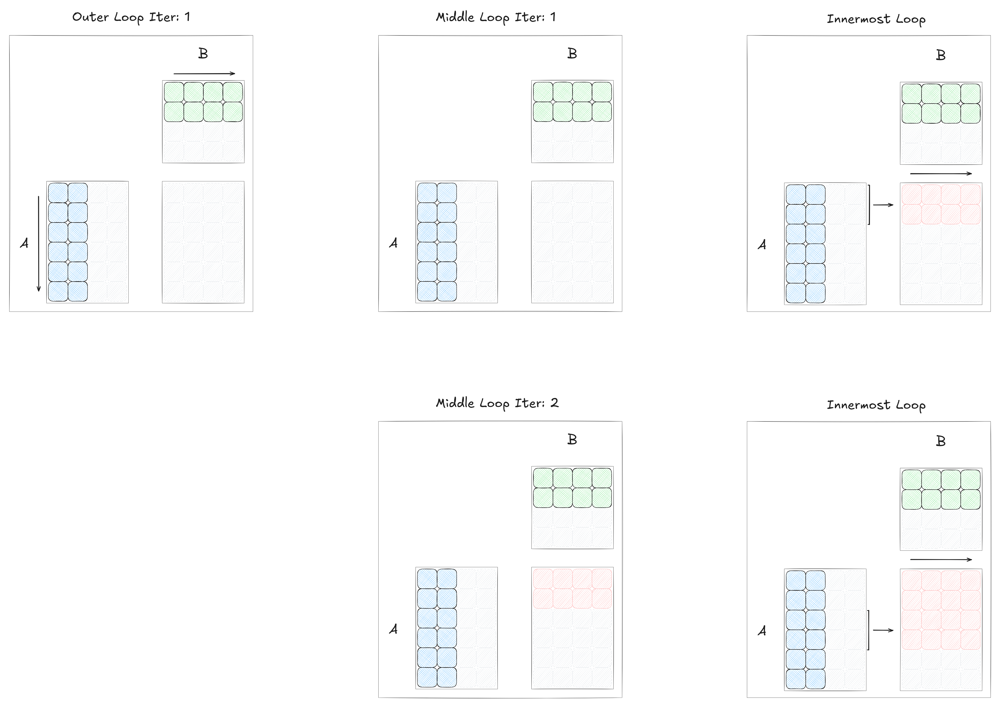

  2. 如下图，按照k维度切分，每次加载的行和列都被充分利用了，没有B矩阵的重复加载：`MMAs performed / Total fragments loads = Fr * Fc / (Fr + Fc) = 1.6`
    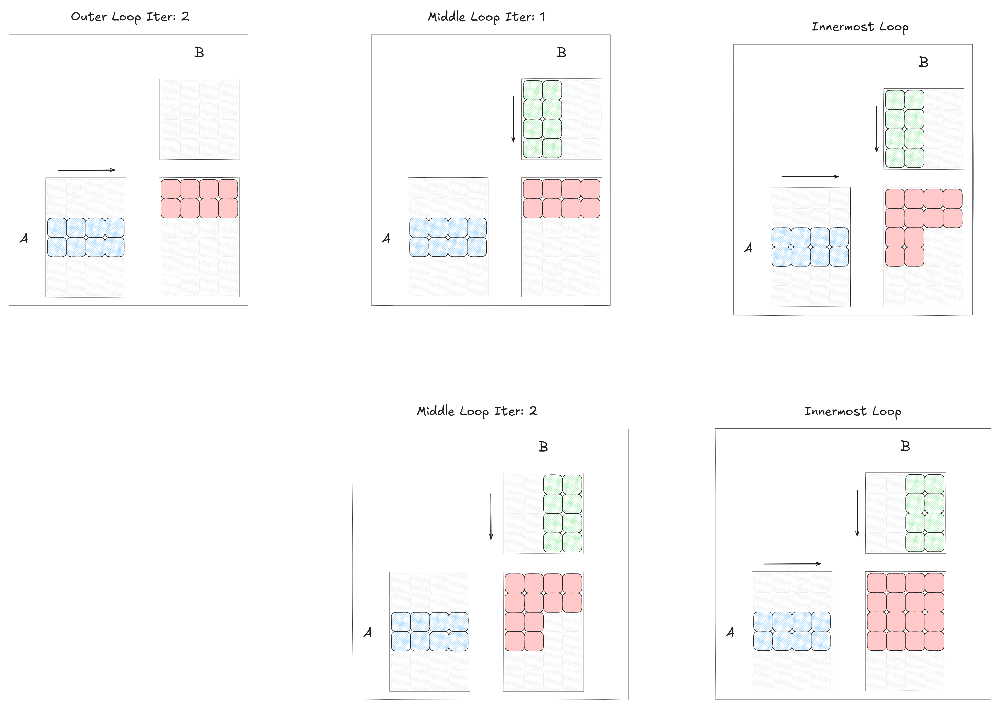

#### Double buffering

根据上一节，一个GEMM沿着K维度被做了切分，切分宽度为`ldmatrix`的加载宽度，即16个元素。一个优化策略是做一个SMEM -> RF的double buffering，从而减少MMA的数据准备时间。虽然`ldmatrix`是一个sync指令，但这样做可以增加指令发射密度，同时减少寄存器的访问压力，从而最大化mma执行效率。

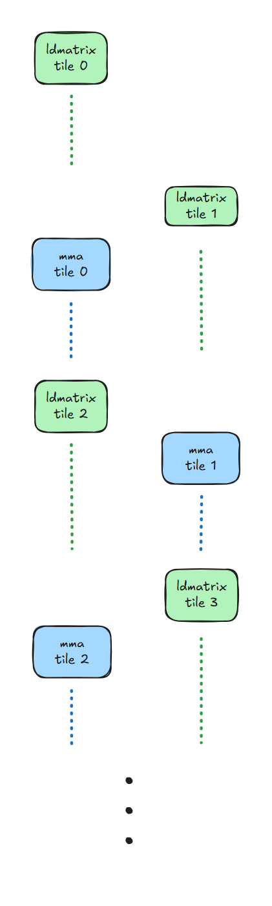

#### m16n8k16对B矩阵的形状要求 & K矩阵的搬运

在[数据访问与Swizzling](./1_数据访问与Swizzling.md)中介绍过，Q, K和V都是使用`ldmatrix.x4`进行加载的。

而使用`ldmatrix.x4`时，加载的(2, 2)维的(8, 8) fragment，是按照col-major排列的，比如thread 0对A矩阵的访问顺序为(0, 1) -> (128, 129) -> (8, 9) -> (136, 137)。而做MMA计算时，对于thread 0，针对B矩阵的元素访问顺序是(0, 1) -> (8, 9)，完成计算需要依次访问(0, 1)和(8, 9)这4个half元素存储的两个32-bit寄存器。


可以看出，由于通过`ldmatrix.x4`加载B矩阵，导致(0, 1) 和(8, 9) 不连续了。这里造成Q矩阵的形状与MMA的要求有了轻微的差异，从而造成编译器需要分配额外的instruction，整理Q矩阵。

解决方案：在使用`ldmatrix.x4`加载Q矩阵时，交换(1, 0)和(0, 1) fragment的位置，这样就使得(0, 1) 和(8, 9) 按列存储，从而使得thread 0可以连续访问。

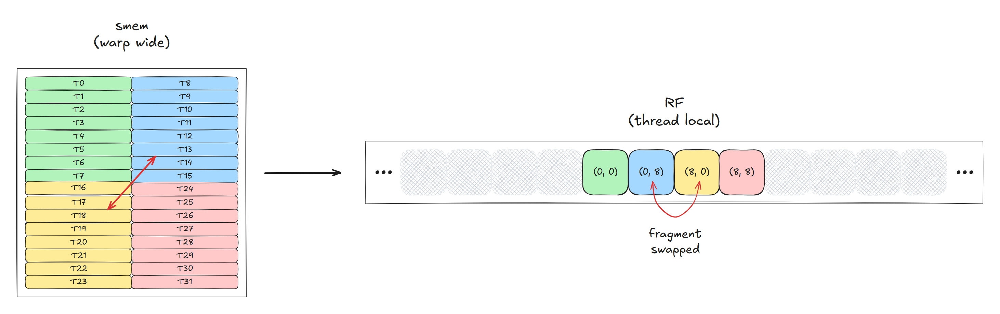

* 与V矩阵加载的比较

  这里与V矩阵从smem到RF的加载做个比较：同样是交换了(1, 0)和(0, 1) fragment的位置，在smem按row-major存储的K矩阵，由于计算的`S = Q @ K^T`要求K矩阵是转置的，而MMA要求B矩阵为col-major，当通过`ldmatrix`加载后，MMA按col-major的顺序读取row-major存储的(8, 8) fragment，相当于对K矩阵做了转置；而smem按照row-major存储的V矩阵，需要完成的计算是`O = P @ V`，要求V是非转置的，因此需要通过`ldmatrix.trans`加载(8, 8) V的fragment。


## Flash Attention's Softmax

### 理论分析

Softmax是深度学习模型最常用的操作之一，基础运算如下面的公式。分母是一个reduce操作(aka `sum`)，在大规模矩阵场景下，单行元素无法完全放入shared memory，需要连续访问global memory，造成IO瓶颈。

Flash Attention通过把softmax改造成分段迭代的形式，显著提高了性能。

$$
\text{Softmax}(x_i) = \frac{\exp(x_i)}{\sum_{j=0}^{N-1} \exp(x_j)}
$$

#### Safe Softmax
  
在上面的公式中，当x_i是一个较大的正数时，取指数会导致数值溢出。因此，一个safe版本的softmax会先统计一个最大值，再将所有元素减去这个最大值，如下面的公式。这里的max，也是一个reduce操作。

$$x_{max} = \max(x_0, x_1, \dots, x_{N-1})$$
$$
\text{Softmax}(x_i) = \frac{\exp(x_i - x_{max})}{\sum_{j=0}^{N-1} \exp(x_j - x_{max})}
$$

#### Online Softmax
  
Online softmax的算法由[Online normalizer calculation for softmax](https://arxiv.org/abs/1805.02867)提出，[Flash Attention 2](https://arxiv.org/abs/2307.08691)利用了其思路完成了对Attention中softmax的分段迭代计算。

所谓online softmax，就是在原长度为`N`的向量的softmax结果的基础上，在线增加新的向量元素，动态求出此时`N + 1`长度向量的softmax结果。

比如针对safe softmax的计算公式：当前序列长度为`N`，当增加一个元素`x_k`时，此时的`x_max`有两个结果，要么是原来的最大值，要么是`x_k`。把前N个元素的最大值记为`m_N`，前N个元素的softmax的分母 $\sum_{j=0}^{N-1} \exp(x_j - x_{max})$ 记为`d_N`，那么，

N + 1 个元素的最大值 $m_{N+1}$ 为：

$$
m_{N+1} = \max(m_N, x_N)
$$

N + 1 个元素的全局累加值，也即softmax的分母 $d_{N+1}$ 为：

$$
\begin{aligned}
d_{N+1} &= \sum_{j=0}^{N} \exp(x_j - m_{N+1}) \\
&= \sum_{j=0}^{N-1} \exp(x_j - m_{N+1}) + \exp(x_N - m_{N+1}) \\
&= \sum_{j=0}^{N-1} \exp(x_j - m_N)⋅\exp(m_N - m_{N+1}) + \exp(x_N - m_{N+1}) \\
&= d_N\exp(m_N - m_{N+1}) + \exp(x_N - m_{N+1})
\end{aligned}
$$

可以看出，全局累加值 $d_{N+1}$ 需要在原来的 $d_N$ 基础上补乘一个系数 $\exp(m_N - m_{N+1})$ 做归一化调整：当全局最大值不变时，系数为1；再加上新元素的对应的分量 $\exp(x_N - m_{N+1})$ 。


#### Flash Attention-2 forward pass

Online softmax算法处理的是一个**序列**，而Attention使用softmax计算注意力分数时，处理的是多个向量组成的**矩阵**。也就是说，注意力分数针对每个查询向量（即Q的每一行），计算其与所有键（K的所有行 `[kv_seq_len, d_head]`矩阵）的注意力权重。由此，每个查询对应了一个(1, kv_seq_len)的注意力分数向量。

在Flash Attention的分块处理任务中，每次循环会处理当前Qi块对应的B_c个键值对，因此，对应的max和sum都是以B_c为单位做的增量处理。

```
# attention state
m = torch.zeros(BLOCK_Q)
tile_O = torch.zeros(BLOCK_Q, DIM)
sumexp = torch.zeros(BLOCK_Q)

for _ in range(Lk // BLOCK_KV):
  # 1st MMA
  tile_S = tile_Q @ tile_K.T  # [BLOCK_Q, BLOCK_KV]
  tile_S = tile_S * scale

  # online softmax
  tile_max = tile_S.amax(dim=-1)  # [BLOCK_Q]
  new_m = torch.maximum(m, tile_max)
  tile_P = torch.exp(tile_S - new_m.unsqueeze(-1))

  # rescale
  scale = torch.exp(m - new_m)
  tile_O *= scale.unsqueeze(-1)
  sumexp = sumexp * scale + tile_P.sum(dim=-1)
  m = new_m  # save new max

  # 2nd MMA
  tile_O += tile_P @ tile_V  # [BLOCK_Q, DIM]

# apply normalization
tile_O /= sumexp.unsqueeze(-1)
```

上面是Flash Attention-2的pseudo-Python代码，在内层循环中，每个查询位置（每行）独立计算自己的softmax。对于查询块`i`中的单个查询`q`，针对KV块`j`中的单个键`k`:

$$
S_{i,q}^{(j,k)} = Q_i[q]·K_j[k]^T / sqrt(dim)
$$

$$
m_q^{(j)} = max(m_q^{(j-1)}, maxoverk(S_{i,q}^{(j,k)}))
$$

运行时分母为：

$$
l_q^{(j)} = exp(m_q^{(j-1)} - m_q^{(j)}) * l_q^{(j-1)} + sumoverk(exp(S_{i,q}^{(j,k)} - m_q^{(j)}))
$$

### 算法实现

#### 基础版本

为了保证准确性，softmax的计算精度为32-bit。所需数据都已存在到RF里面，所以不涉及LD/ST操作。

1. 初始化m向量为-inf，l向量为0.0
2. 将前一步矩阵乘QK^T算出来的分数S缩放，即将S逐元素与 $1/\sqrt{d_{head}}$ 相乘
3. 通过Warp Shuffle在RF上做reduction来同步`m`，避免访问共享内存
    * CUDA内置函数，通过"异或"模式交换数据：`__shfl_xor_sync()`
      
      `T __shfl_xor_sync(unsigned mask, T var, int xor_offset, int width=warpSize);`
        * `var`: 要交换的值
        * `xor_offset`：异或偏移量，thread根据自己的tid，读取`tid ^ xor_offset`，来确定交换伙伴
        * `mask`: 指定参与交换的线程
    * Reduction：
    
      如下图所示，一个warp处理一个(8, 8)shape的fragment，每行对应一个Query，由4个线程处理。由Reduction需要让这4个thread充分同步数据。使用异或操作，两两间进行一次信息交换，最小沟通次数为`4 = 2^2`，即2次。

      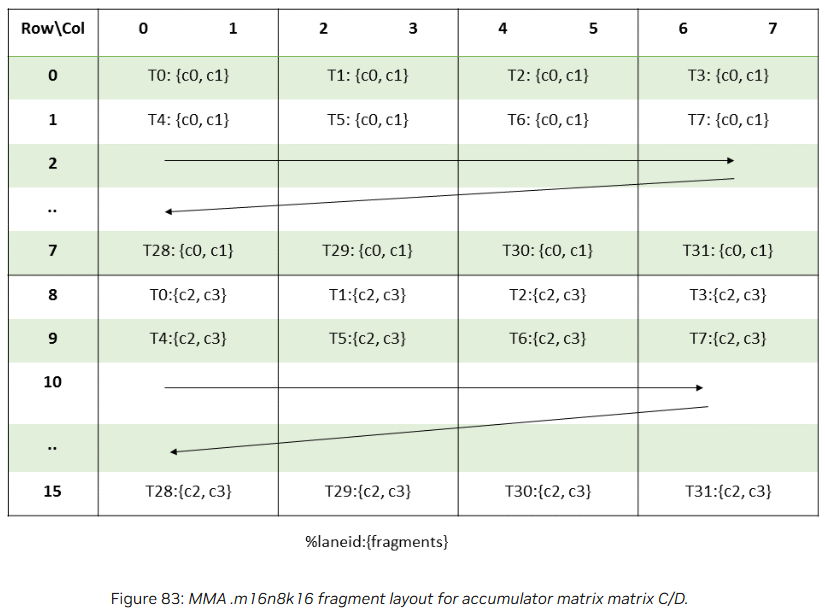

      即：

      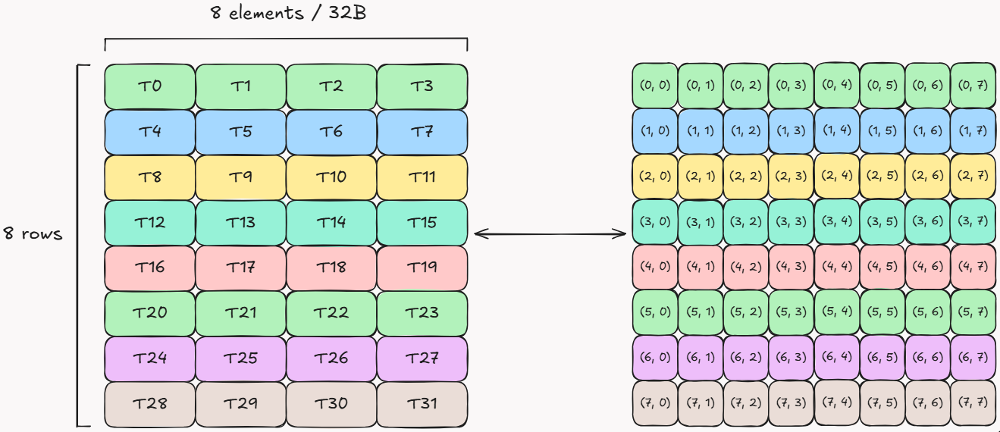

      * 规约的三个阶段
        * 首先，在thread内进行规约，求得当前thread的最大值
        * 然后，进行warp内的第一次归约 - 第一次异或交换（offset=2）
          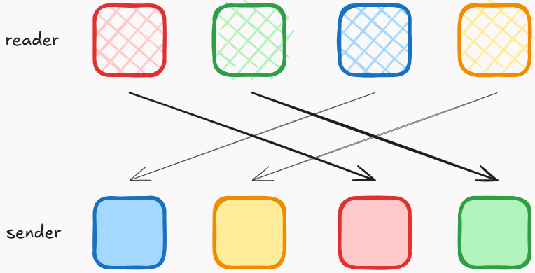
        * 最后，进行warp内的第二次归约 - 第二次异或交换（offset=1）
          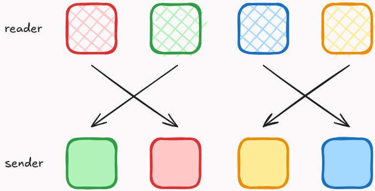
4. `l`和`Oj`的rescale
    * 根据reduction得到的`m`，计算相应的`l`和`Oj`
5. `Sj`求指数
6. `l`的partial reduction
    因为l只有到最后需要normalize O时才会被用到，所以现在跳过warp shuffle。只做当前thread的sum。
7. Softmax Epilogue
    * 同一行的4个thread之间，通过warp shuffle同步`l`，从而得到最终的`l`
    * 基于当前block的`l`，normalize `O`


#### 优化：Fusing FP Multiplication and Addition in Softmax

在上述的基础版本中，Softmax的运算都是分开进行的。而利用FFMA(fused multiply-add)指令 `d = a * b + c`，可以将多个运算合并起来，从而减少指令数量。

1. 将计算注意力分数的scale运算，逐元素乘系数 $\alpha = 1/\sqrt{d_{head}}$，放进Safe attention减去最大值的操作 $S_{i}^{(j)} - m^{(j)}$里，变成 $\alpha⋅S_{i}^{(j)} - \tilde{m}^{(j)}$，其中 $\tilde{m}^{(j)} = \alpha⋅m^{(j)}$
   
2. 将`expf(x)`显示地改写成更快的`exp2f(x * log2e)`( $e^{x} = 2^{x \cdot \log_{2}e}$ )，并提前把常数`log2e`合并到 $\alpha$中。更新后， $\alpha = \log_{2}e/\sqrt{d_{head}}$。


> 详细计算过程可参考[Fusing FP Multiplication and Addition in Softmax](https://lubits.ch/flash/Part-6#fusing-fp-multiplication-and-addition-in-softmax):
> 
> Softmax计算原始版：完成一个KV tile的计算需要 `W_r(5.5W_c + W_d + 6)` instructions
> 
> 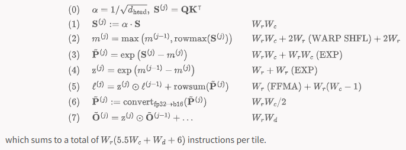
> 
> Softmax优化版：完成一个KV tile的计算需要 `W_r(4.5W_c + W_d + 8)` instructions
> 
> 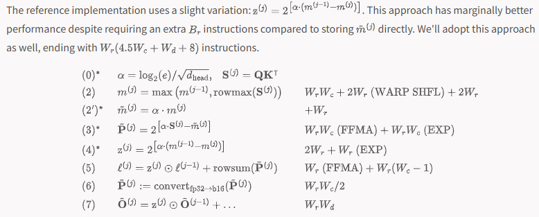
