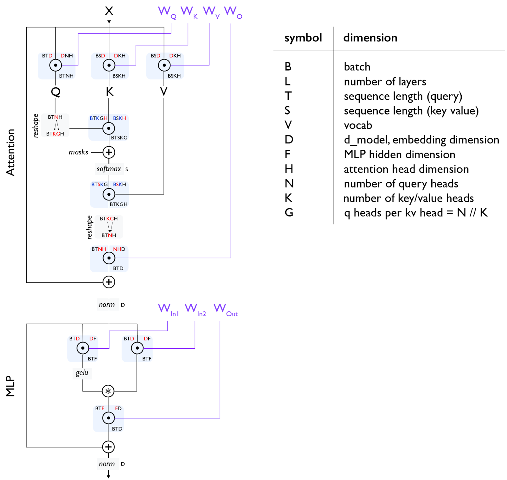
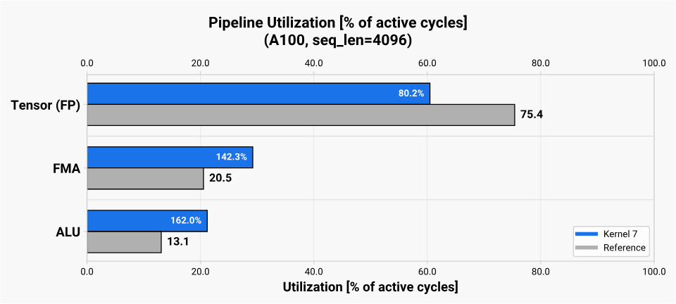
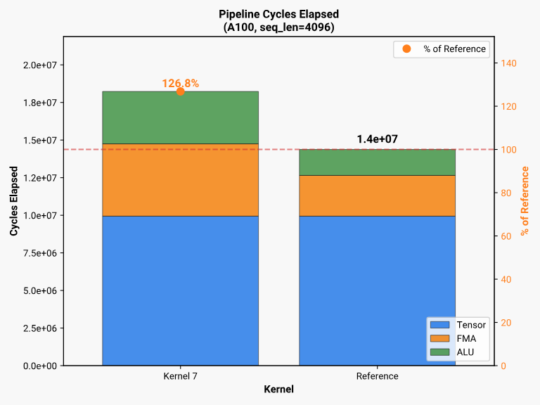
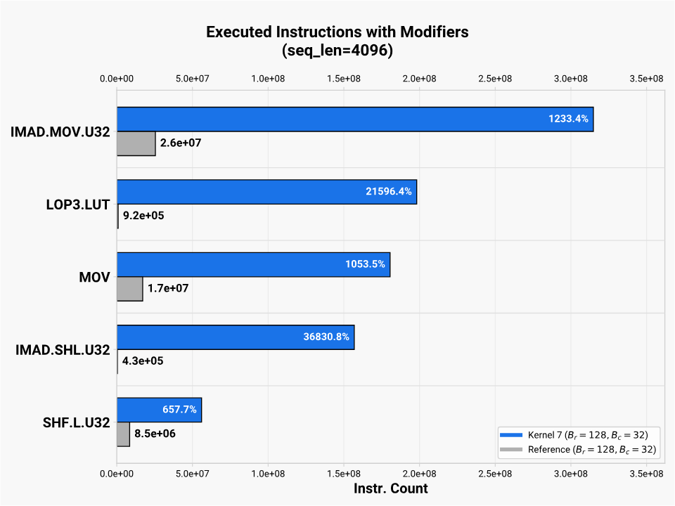
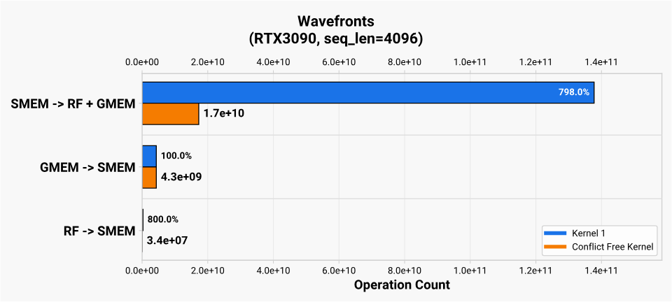

# Resource Accounting & Profiling Tips

## Attention Resource Accounting

### Overall Accounting

[下图](https://jax-ml.github.io/scaling-book/transformers/)是Transformer decoder的架构和对应的notation。



对于Attention layer，下面是基于Flash Attention的resource的粗略计算，这里忽略了softmax的flops。

Initial stats:

  `flops = 0`

  `bytes_transferred = 0`

1. 从HBM中读取 Q (B x T x D), K (B x S x D), V (B x S x D)，half精度，占用2B
   `bytes_transferred = 2*B*T*D + 2*B*S*D + 2*B*S*D`
2. 计算 S = Q (B x T x D) @ K (B x S x D)
    `flops += 2*B*S*T*D`
3. 计算 O = softmax(S) (B x S x T x K x G) @ V (B x S x K x H)
    `flops += 2*B*S*T*D`
4. 写入 O 到HBM
    `bytes_transferred += 2*B*T*D`

最后：

`flops == 4*B*S*T*D`, 

`bytes_transferred == 4*B*S*D + 4*B*T*D`

故，`arithmetic_intensity = S * T/(S + T)`

对于Prefill阶段来说，通常T = S，`intensity = S/2`；对于decode阶段来说，T = 1，意味着`intensity = 1`，严重memory-bound。


Ampere GPUs A100和RTX 3090的性能指标如下：

| Device    | GMEM bandwidth | mma TFLOPs/s (16b input 32b accum) | FP32 TFLOPs/s | mma / FP32 ratio | MUFU TFLOPs/s | Compute Capability |
|:----------|:---------------|:-----------------------------------|:--------------|:-----------------|:--------------|:-------------------|
| A100      | 1.94 TB/s      | 311.84                             | 19.5          | 16x              | 4.875 (19.5/4)| 8.0                |
| RTX 3090  | 936.2 GB/s     | 71                                  | 35.6          | 2x               | 4.45 (35.6/8) | 8.6                |

根据`accelerator_intensity = flops_per_second / memory_bandwidth`，基于GMEM的Accelerator Intensity如下图：

| Device | mma TFLOPs/s (16b input 32b accum) | GMEM bandwidth (TB/s) | 计算过程 | Accelerator Intensity |
|:-------|:-------------------|:---------------------|:---------|:-----------|
| NVIDIA A100 | 311.84 | 1.94 | 311.84e12 / 1.94e12 | ≈ 160.74 |
| NVIDIA RTX 3090 | 71 | 0.9362 | 71e12 / 0.9362e12 | ≈ 75.84 |

根据Attention的Prefill阶段的`intensity = S/2`，可以估算出hit GMEM roofline的序列长度。


### 一个Attention tile的 Resource Accounting

下面的算法包含了`tile_softmax_flop()`，用于累计softmax的计算量。

```
ELEM_SIZE = 2  # bytes
 
def tile_softmax_flop(B_r, B_c, d_head) -> int:
    # Kernel 6-16
    return B_r * (4 * B_c + d_head + 4)
    # Kernel 1-5
    return B_r * (5 * B_c + d_head + 3)
 
def kv_tile_flop(B_r, B_c, d_head) -> int:
    QK_flops = 2 * B_r * d_head * B_c
    PV_flops = 2 * B_r * B_c * d_head
 
    softmax_flops = tile_softmax_flop(B_r, B_c, d_head)
 
    return QK_flops + PV_flops + softmax_flops
 
def gmem_transfer_size(B_r, B_c, d_head) -> int:
    return d_head * 2 * (B_r + B_c) * ELEM_SIZE
 
def arithmetic_intensity(B_r, B_c, kv_seq_len, d_head) -> float:
    return (
        kv_tile_flop(B_r, B_c, d_head) * (kv_seq_len // B_c)
    ) / gmem_transfer_size(B_r, kv_seq_len, d_head)
 
```

算术强度的上限是当kv_seq_len趋向于无穷大，此时的推导公式如下，上限近似等于 $B_r$。

$$
\text{AI}_{\max} \approx B_r \times \left( 1 + \frac{1}{d\_{head}} + \frac{1}{4 B\_c} + \frac{1}{d\_{head} \cdot B\_c} \right)
$$

当`kv_seq_len = 4096, B_r = 64, B_c = 64, d_head = 128`时，arithmetic intensity为\~64；当`kv_seq_len = 4096, B_r = 128, B_c = 64, d_head = 128`时，arithmetic intensity为\~129。

可以看出，在RTX3090上，B_r = 64时，arithmetic intensity为\~64，接近Accelerator Intensity 75；在A100上，B_r = 128时，arithmetic intensity为\~129，接近Accelerator Intensity 160.74。


### Kernel 1的资源计算

针对block `B_r = 64, B_c = 64, d_head = 128`在RTX3090上的资源配置分析：

* Basic: 4 warps for each CTA for a total of 128 threads
* Threads per CTA
  
  SM_86 支持每个SM最高1536个thread，因此在这个kernel中，每个SM最高可以有1536/128 = 12 CTAs，不会成为瓶颈
* Registers per Thread
  
  SM_86上，每个SM有65536个register。每个thread最多访问255个register。在kernel 1版本中，一共用了202个 register，那么`65536/202 ~= 324 threads ~= 8 warps ~= 2 CTAs per SM`
* Shared Memory per CTA
  
  SM_86上，每个SM有99KiB的SMEM，基于`B_r = 64, B_c = 64, d_head = 128`：
    * Q 和 O：`B_r x d_head x sizeof(value_t) = 16KiB`
    * K 和 V：`B_c x d_head x sizeof(value_t) = 16KiB`
  Q和O不会overlap，可以共享相同的内存空间，因此每个CTA占用48KiB；2 CTAs per SM不会超出SMEM上限。

总结：在`B_r = 64, B_c = 64, d_head = 128`的block配置下，每个SM启动2个CTA，每个CTA包含4个Warp，分配48KB SMEM，每个warp包含32个thread，每个thread访问202 registers。


## Profiling on RTX3090 and A100

对比reference kernel，Kernel 7在RTX3090达到了101.5%的performance；但在A100上，只有80.3%。

[Why](https://lubits.ch/flash/Part-7)?


### Compute Pipeline

Profile Kernel 7在A100的表现之后，一个显著的不同是Kernel 7的scalar pipelines远多于reference kernel。




检查SASS instruction后，围绕地址计算的instruction过多，罪魁祸首是最初版本的swizzle算法，详细解决方案见[数据访问与Swizzling](./1_数据访问与Swizzling.md)。

> * IMAD: integer multiply-add
> * LOP3.LUT: bitwise logic operation with 3 operands
> * MOV: register copy
> * SHF: bit shift



* Why the A100 Suffers: Throughput Ratios
  
  原因在于mma / FP32 ratio：A100的ratio是16x，而RTX3090是2x。由于RTX3090执行mma比较慢，即使数据搬得慢，影响也更小。
  
### Block Size Limitations

在前面的Resource accouting中计算过，A100上，性能最好的点是当(B_r = 128)的时候。但是在(B_r = 128, B_c = 64)时，会发生register spills。这点，通过static swizzling也得到了缓解。

| (Br, Bc, nwarps) | Registers per Thread | SMEM per CTA | Warps per SM |
|:-----------------|:---------------------|:-------------|:-------------|
| (64, 64, 4)      | 229                  | 48KiB        | 8            |
| (64, 32, 4)      | 168                  | 32KiB        | 12           |
| (128, 32, 4)     | 255 (0B spilled)     | 48KiB        | 8            |
| (128, 64, 4)     | 255 (272B spilled)   | 64KiB        | 4 (RTX 3090)<br>8 (A100) |

## Useful notes

#### Metrics to check

* Bank Conflicts
  
  Double check `derived__memory_l1_wavefronts_shared_excessive`, = `memory_l1_wavefronts_shared - memory_l1_wavefronts_shared_ideal`

* Memory Utilization
  
  `l1tex__data_pipe_lsu_wavefronts_mem_shared_op_ld.sum.pct_of_peak_sustained_elapsed`, i.e.
  

* [Warp Stalls](https://lubits.ch/flash/Part-4#warp-stalls)
  
  `smsp__pcsamp_warps_issue_stalled_*` metrics
    * `smsp__pcsamp_warps_issue_stalled_selected`: success
    * `..._not_selected`: another warp is chosen instead
    * `..._barrier` stalls:  waiting for other warps in the CTA at a `__syncthreads()` checkpoint

    有用的指标来观察kernel的效率：
    * `short_scoreboard`: 等待LTSD到SMEM的数据或者latency较长的指令如`exp`
    * `long_scoreboard`: GMEM和LMEM的相关操作
    * `mio_throttle`: instruction queues for longer operations become full，warp空等

    详细可参考[Nsight Compute documentation](https://docs.nvidia.com/nsight-compute/ProfilingGuide/index.html#id33)。

* Register Pressure
  
  [nvcc Flags for Register Spilling](https://lubits.ch/flash/Appendix#nvcc-flags-for-register-spilling)
  Cause: 当RF不够大时，compiler会spill register value to LMEM (L1 -> L2 -> DRAM)。
